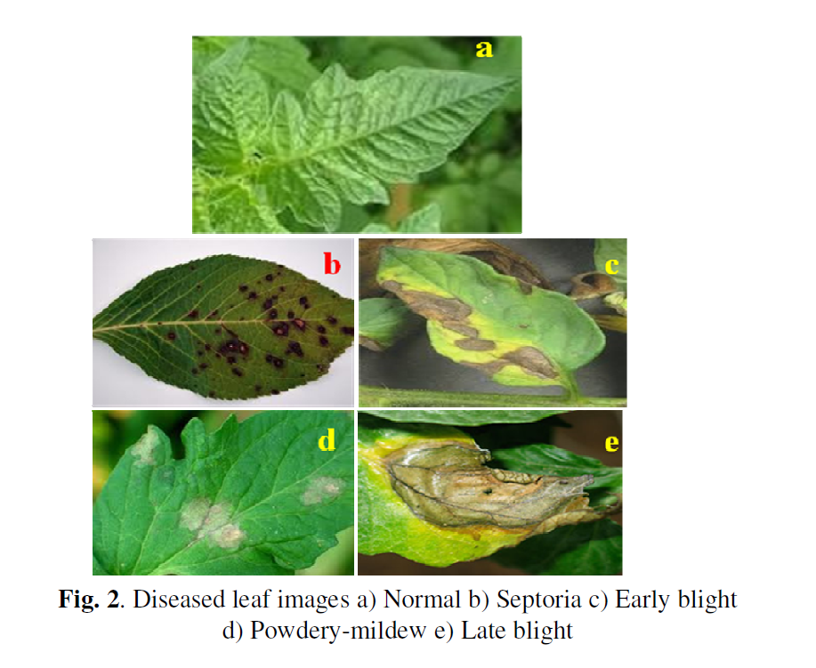
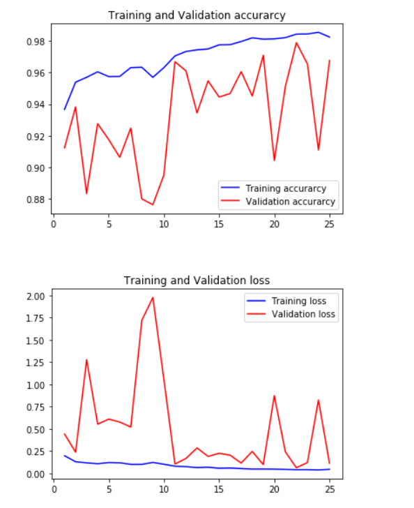

# Plant Disease Detection Using Convolutional Neural Network

## Introduction

The problem of efficient plant disease protection is closely related to the problems of sustainable agriculture. Inexperienced pesticide usage can cause the development of long-term resistance of the pathogens, severely reducing the ability to fight back. Timely and accurate diagnosis of plant diseases is one of the pillars of precision agriculture. It is crucial to prevent unnecessary waste of financial and other resources, thus achieving healthier production in this changing environment. Appropriate and timely disease identification including early prevention has never been more important.

There are several ways to detect plant pathologies. Some diseases do not have any visible symptoms, or the effect becomes noticeable too late to act. In such situations, a sophisticated analysis is obligatory. However, most diseases generate some kind of manifestation in the visible spectrum, so naked eye examination of a trained professional is the prime technique adopted in practice for plant disease detection.

To achieve accurate plant disease diagnostics, a plant pathologist should possess good observation skills to identify characteristic symptoms. Variations in symptoms indicated by diseased plants may lead to improper diagnosis since amateur gardeners and hobbyists could have more difficulties determining it than a professional plant pathologist.

An automated system designed to help identify plant diseases by the plant's appearance and visual symptoms could be of great help to amateurs in the gardening process and also trained professionals as a verification system in disease diagnostics. Advances in computer vision present an opportunity to expand and enhance the practice of precise plant protection and extend the market of computer vision applications in the field of precision agriculture.

### Neural Networks and Deep Learning

In machine learning and cognitive science, Artificial Neural Networks (ANNs) are information-processing paradigms inspired by the way biological nervous systems, such as the brain, process information. Neural networks or connectionist systems are computational approaches based on a large collection of neural units (artificial neurons), loosely mimicking the way a biological brain solves problems with large clusters of biological neurons connected by axons.

Each neural unit is connected with many others, and links can be enforcing or inhibitory in their effect on the activation state of connected neural units. Each individual neural unit may have a summation function which combines the values of all its inputs together. These systems are self-learning and trained, rather than explicitly programmed, and excel in areas where the solution or feature detection is difficult to express in a traditional computer program.

Neural networks typically consist of multiple layers, and the signal path traverses from front to back. Back propagation is the use of forward stimulation to reset weights on the "front" neural units. More modern networks are more free-flowing in terms of stimulation and inhibition with connections interacting in a much more chaotic and complex fashion. Dynamic neural networks are the most advanced, as they dynamically can, based on rules, form new connections and even new neural units while disabling others.

The goal of the neural network is to solve problems in the same way that the human brain would. Modern neural network projects typically work with a few thousand to a few million neural units and millions of connections, which are still several orders of magnitude less complex than the human brain. New brain research often stimulates new patterns in neural networks, including deep learning approaches that interpolate greater complexity than simple Boolean variables.

The neuron has weights for each input and an overall bias. The weights are real numbers expressing the importance of the respective inputs to the output. The bias is used for controlling how easy the neuron is getting to output 1. For a neuron with a really big bias, it is easy to output 1, but when the bias is very negative, then it is difficult to output 1.

---

## Materials and Methods

### The Dataset

The Dataset was taken from Kaggle's PlantVillage dataset available online. The code was also written on the online kernel of Kaggle for better computation and analysis of training loss and validation.

**Dataset Link:** https://www.kaggle.com/sumanismcse/plant-disease-detection-using-keras

### Image Preprocessing and Labelling

Preprocessing images commonly involves:
- Removing low-frequency background noise
- Normalizing the intensity of individual particle images
- Removing reflections
- Masking portions of images

Image preprocessing is the technique of enhancing data. The procedure of image preprocessing involved cropping of all the images manually, making squares around the leaves to highlight the region of interest (plant leaves).

During the phase of collecting images for the dataset, images with smaller resolution and dimension less than 500 pixels were not considered as valid images. In addition, only images where the region of interest was in higher resolution were marked as eligible candidates for the dataset. This ensured that images contain all the needed information for feature learning.

Agricultural experts examined leaf images and labeled all images with appropriate disease acronyms. It is important to use accurately classified images for the training and validation dataset. Only in that way may an appropriate and reliable detecting model be developed. Duplicated images that were left after the initial iteration of gathering and grouping images into classes were removed from the dataset.

### Neural Network Training

#### TensorFlow Framework

Training the deep convolutional neural network for making an image classification model from a dataset was proposed using TensorFlow. TensorFlow is an open source software library for numerical computation using data flow graphs. Nodes in the graph represent mathematical operations, while the graph edges represent the multidimensional data arrays (tensors) communicated between them.

The flexible architecture allows deployment of computation to one or more CPUs or GPUs in a desktop, server, or mobile device with a single API. TensorFlow was originally developed by researchers and engineers working on the Google Brain Team within Google's Machine Intelligence research organization for conducting machine learning and deep neural networks research.

#### Convolutional Neural Networks (CNNs)

In machine learning, a convolutional neural network is a type of feed-forward artificial neural network in which the connectivity pattern between its neurons is inspired by the organization of the animal visual cortex. Individual cortical neurons respond to stimuli in a restricted region of space known as the receptive field. The receptive fields of different neurons partially overlap such that they tile the visual field.

The response of an individual neuron to stimuli within its receptive field can be approximated mathematically by a convolution operation. Convolutional networks were inspired by biological processes and are variations of multilayer perceptron designed to use minimal amounts of pre-processing. They have wide applications in image and video recognition, recommender systems, and natural language processing.

Convolutional neural networks (CNNs) consist of multiple layers of receptive fields. These are small neuron collections which process portions of the input image. The outputs of these collections are then tiled so that their input regions overlap, to obtain a higher-resolution representation of the original image; this is repeated for every such layer. Tiling allows CNNs to tolerate translation of the input image.

Convolutional networks may include local or global pooling layers, which combine the outputs of neuron clusters. They also consist of various combinations of convolutional and fully connected layers, with point-wise nonlinearity applied at the end of or after each layer.

#### Convolutional Layers

A convolution operation on small regions of input is introduced to reduce the number of free parameters and improve generalization. One major advantage of convolutional networks is the use of shared weights in convolutional layers, which means that the same filter (weights bank) is used for each pixel in the layer. This both reduces memory footprint and improves performance.

The layer's parameters consist of a set of learnable kernels (filters), which have a small receptive field but extend through the full depth of the input volume. During the forward pass, each filter is convolved across the width and height of the input volume, computing the dot product between the entries of the filter and the input and producing a 2-dimensional activation map of that filter.

As a result, the network learns filters that activate when it detects some specific type of feature at some spatial position in the input. Stacking the activation maps for all filters along the depth dimension forms the full output volume of the convolution layer.

When dealing with high-dimensional inputs such as images, it is impractical to connect neurons to all neurons in the previous volume because such network architecture does not take the spatial structure of the data into account. Convolutional networks exploit spatially local correlation by enforcing a local connectivity pattern between neurons of adjacent layers: each neuron is connected to only a small region of the input volume.

#### Hyperparameters

Three hyperparameters control the size of the output volume of the convolutional layer:

**1. Depth of the output volume:** Controls the number of neurons in the layer that connect to the same region of the input volume. All of these neurons will learn to activate for different features in the input. For example, if the first Convolutional Layer takes the raw image as input, then different neurons along the depth dimension may activate in the presence of various oriented edges or blobs of color.

**2. Stride:** Controls how depth columns around the spatial dimensions (width and height) are allocated. When the stride is 1, a new depth column of neurons is allocated to spatial positions only 1 spatial unit apart. This leads to heavily overlapping receptive fields between the columns and also to large output volumes. Conversely, if higher strides are used, then the receptive fields will overlap less and the resulting output volume will have smaller dimensions spatially.

**3. Zero-Padding:** Controls the spatial extent of output volume in conjunction with depth and stride.

#### ReLU Activation Function

Rectified Linear Units (ReLU) are used as substitute for saturating nonlinearities. This activation function adaptively learns the parameters of rectifiers and improves accuracy at negligible extra computational cost. The rectifier is an activation function defined as:

```
f(x) = max(0, x)
```

where x is the input to a neuron. This is also known as a ramp function and is analogous to half-wave rectification in electrical engineering.

The rectifier was first introduced to a dynamical network with strong biological motivations and mathematical justifications. It has been used in convolutional networks more effectively than the widely used logistic sigmoid and its more practical counterpart, the hyperbolic tangent. The rectifier is, as of 2015, the most popular activation function for deep neural networks. Deep CNNs with ReLUs train several times faster than those with sigmoid activations.

#### Feature Maps and Batch Normalization

In CNN, neurons within a hidden layer are segmented into "feature maps." The neurons within a feature map share the same weight and bias and search for the same feature. These neurons are unique since they are connected to different neurons in the lower layer. The hidden layer is segmented into feature maps where each neuron in a feature map looks for the same feature but at different positions of the input image. Basically, the feature map is the result of applying convolution across an image.

Batch normalization is applied after ReLU nonlinearity after the first and second convolutional layers because it reduces top-1 and top-5 error rates.

#### Parameter Sharing

Parameter sharing scheme is used in convolutional layers to control the number of free parameters. It relies on one reasonable assumption: if one patch feature is useful to compute at some spatial position, then it should also be useful to compute at a different position.

Since all neurons in a single depth slice share the same parameterization, the forward pass in each depth slice of the CONV layer can be computed as a convolution of the neuron's weights with the input volume. Therefore, it is common to refer to the sets of weights as a filter (or a kernel), which is convolved with the input. Parameter Sharing contributes to the translation invariance of the CNN architecture.

#### Pooling and Dropout

Pooling operation gives the form of translation invariance; it operates independently on every depth slice of the input and resizes it spatially. Overlapping pooling is beneficially applied to lessen overfitting.

In favour of reducing overfitting, a dropout layer is used in the first two fully connected layers. The shortcoming of dropout is that it increases training time 2-3 times compared to a standard neural network of the exact architecture. Bayesian optimization experiments proved that ReLUs and dropout have synergy effects, meaning it is advantageous when they are used together.

The advance of CNNs refers to their ability to learn rich mid-level image representations as opposed to hand-designed low-level features used in other image classification methods.

---

## Network Architecture



The model uses a deep convolutional neural network with multiple convolutional layers with ReLU activation, batch normalization, maxpooling layers, dropout layers, and fully connected layers.


---

## Results and Conclusion

### Performance Results

The results presented in this section are related to training with the whole database containing both original and augmented images. As convolutional networks are able to learn features when trained on larger datasets, results achieved when trained with only original images will not be explored.

**After fine-tuning the parameters of the network, an overall accuracy of 96.77% was achieved.**

Furthermore, the trained model was tested on each class individually. Test was performed on every image from the validation set.



### Model Evaluation

As suggested by good practice principles, achieved results should be compared with some other results. In addition, there are still no commercial solutions on the market, except those dealing with plant species recognition based on leaf images.

This project explored the use of deep learning methods to automatically classify and detect plant diseases from leaf images. The complete procedure was described, from collecting the images used for training and validation to image pre-processing, augmentation, and finally the procedure of training the deep CNN and fine-tuning.

Different tests were performed in order to check the performance of the newly created model. As the presented method has not been exploited in the field of plant disease recognition (to our knowledge), there was no comparison with related results using the exact technique.

### Conclusion

This work presents a comprehensive approach to plant disease detection using deep convolutional neural networks. The methodology covers:

1. Dataset collection and curation with agricultural expert validation
2. Rigorous image preprocessing and standardization
3. Deep CNN architecture design and training
4. Model fine-tuning and optimization
5. Comprehensive performance evaluation

The achieved accuracy of 96.77% demonstrates the effectiveness of deep learning for automated plant disease recognition. This system can serve as a valuable tool for:
- Agricultural professionals in disease diagnostics
- Farmers for early disease detection and prevention
- Researchers in precision agriculture
- Hobbyists and amateur gardeners

The simplicity and effectiveness of the developed model make it suitable for practical deployment in real-world agricultural applications.
